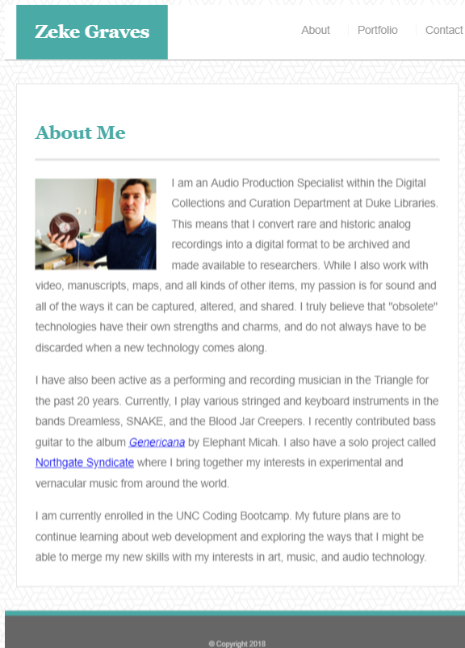
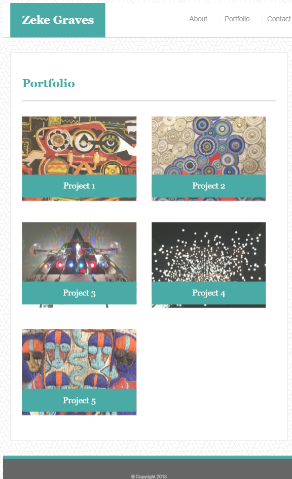
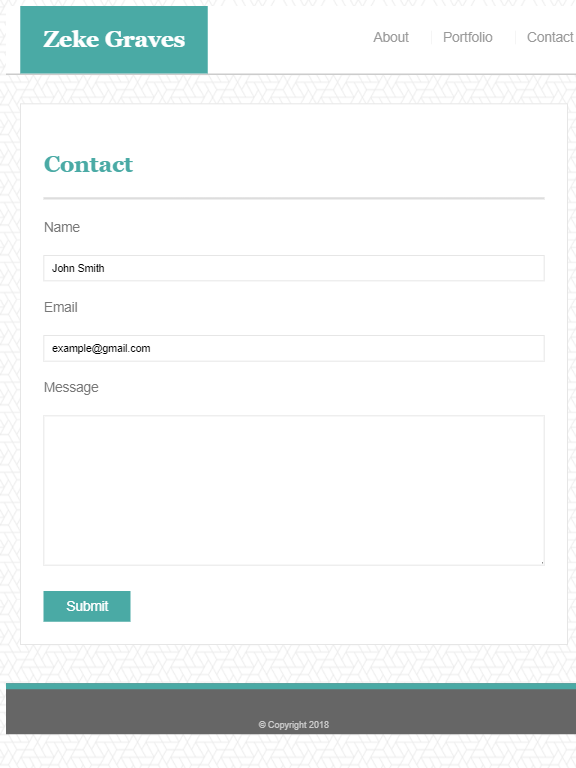

# Responsive-Portfolio
## UNC Coding Bootcamp Homework #2  9-13-2018

This assignment required building a responsive website with Bio, Portfolio, and Contact pages based on templates given only as jpeg images. 

It demonstrates an understanding of Responsive Web Design using media queries with CSS and HTML.

This app sets breakpoints at 980, 768, and 640 pixels to adjust layout for different width screens.

My deployed app can be viewed here: https://zinc-glaze.github.io/Responsive-Portfolio/

### Screenshots

